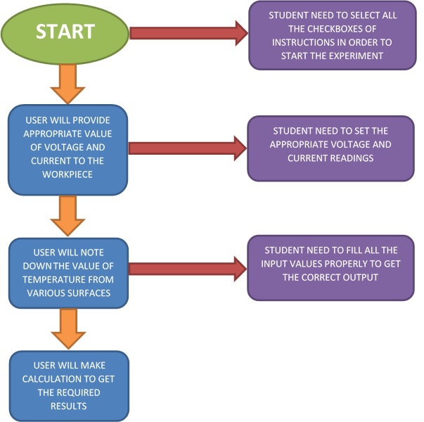

## Storyboard (Round 2)

Experiment 1: Critical thickness of insulation of metal rod

### 1. Story Outline:

The experiment is about the determining the critical thickness of metal rod. We know that by adding more insulation to a wall always decreases heat transfer. The thicker the insulation, the lower the heat transfer rate. This is expected, since the heat transfer area A is constant, and adding insulation always increases the thermal resistance of the wall without affecting the convection resistance. Adding insulation to a cylindrical  metal piece or a spherical shell, however,  is a different matter. The additional insulation increases the conduction resistance of the insulation layer but decreases the convection resistance of the surface because of the increase in the outer surface area for convection. In this experiment, simulator will give the the result of critical thickness ,and the critical radius upto which amount of heat transfer could be increased.

### 2. Story:

In this experiment, we are finding the critical thickness of insulation of metal rod. First we have to switch on the power and set the appropriate voltage and current readings. This power supply will heat up the metal rod which is covered with the PoP insulation. After the heating temperatures would be developed on metal surface and insulation surface and with the help of Newton’s Law of cooling. Convectivity coefficient could be evaluated and it will help to calculate the critical thickness of insulation.

#### 2.1 Set the Visual Stage Description:
Simulator starts with the some basic instructions which the user need to read carefully. First we have to turn on the power supply. After this , we have to insert the value of components like as diameter of the metal rod, voltmeter ,ammeter and the value of connective heat transfer co-efficient. By this we will get the value of critical radius. We will provide appropriate amount of heat to the workpiece in the form of (Q=VI). We will determine amount of heat conducted from metal rod to insulation and amount of heat convected from insulation to temperature. The main purpose is to determine the critical radius upto which amount of heat transfer could be increased.

#### 2.2 Set User Objectives & Goals:
1. To give users a feel for the real world systems and how to use theoretical knowledge on practical system.
2. User will be able to improve his knowledge in the field of heat through conduction.
3. User will be able to understand the importance of insulation addition in conductive and convective heat transfer.
4. User will be able to apply his knowledge of critical radius to improve the amount of heat transfer.
5. User will be able to analyze and evaluate the conductive and convective heat transfer coefficient and also determine the critical radius for particular material.

#### 2.3 Set the Pathway Activities:

1. Student will switch on the power button
2. Student will set the appropriate value of voltage and current
3. Student will wait for the steady state and note down the temperature.
4. Student will perform the calculation part and get the value of required result.

##### 2.4 Set Challenges and Questions/Complexity/Variations in Questions:

1. Illustrate the effect of change in outer radius of the hollow cylinder on the thermal resistance of conduction?
a. the thermal resistance of conduction increases with increase in outer radius of the hollow cylinder
b. the thermal resistance of conduction decreases with increase in outer radius of the hollow cylinder
c. the thermal resistance of conduction remains same with change in outer radius of the hollow cylinder
d. unpredictable
2. What is the effect of change in outer radius of the hollow cylinder on the thermal resistance of convection?
a. the thermal resistance of convection increases with increase in outer radius of the hollow cylinder
b. the thermal resistance of convection decreases with increase in outer radius of the hollow cylinder
c. the thermal resistance of convection remains same with change in outer radius of the hollow cylinder
d. unpredictable
3. What is the formula for thermal resistance for convection at the outer surface of hollow cylinder?
Where,
h = convection heat transfer coefficient
l = length of hollow cylinder
r = outer radius of the cylinder
a. Rc = 1 / h r l
b. Rc = 2 π h r l
c. Rc = 1 / 2 π h r l
d. none of the above

##### 2.5 Allow pitfalls:
1. Student need to select all the checkboxes of instructions in order to start the experiment.
2. Student need to set the appropriate voltage and current readings.
3. Student need to fill all the input values properly to get the correct output.

##### 2.6 Conclusion:
After completion of the experiment student will able to conclude that when we add insulation around cylindrical or spherical surface, rate of heat transfer will increase upto certain limit and after this particular value heat transfer will start decreasing. That limit is called critical radius of insulation. The rate of heat transfer increases because of combined mode of heat transfer as conductive heat decreases in logarithmic manner and convective heat transfer increases linearly so its combined effect increases the amount of heat transfer.

##### 2.7 Equations/formulas:
T1= Temperature of metal rod (inner surface)
T2= Temperature of outer Surface
T3= Ambient Temperature
Convective heat transfer Q= hA(T2-T3)……………..(1)
Heat Supplied to metal rod Q=VI…………….(2)
From equation 1 & 2
VI= hA(T2-T3)
Area of rod A= ΠDL (D= Diameter of rod, L= Length of rod)
 k= thermal conductivity of metal rod
Critical Radius(Rc)= k/h

### 3. Flowchart 
 
link to flow chart Here : <a href="flowchart/flowchart.png" > [here] </a>
 
(guide :The lab proposer should extract logic from the story, prepare a flowchart from the story narration and write the algorithm to execute the black box.  use Google Drawings https://docs.google.com/drawings/ (send the link to your flowchart and also attach .png by exporting it )

### 4. Mindmap:

 Link to mindmap here : <a href="mindmap/Mind Mapping- Critical Radius of Rod.pdf" > [here] </a>
  
 (guide : An elaborate mind map (connecting all the points in the experiment flow ) should be prepared and submitted by the lab proposer. The mind map should be a clear and detailed document that takes into account all minute intri5acies involved in the development of virtual lab. The mindmap should be self-content and any developer across the globe should be able to code it with all those details. using only FreeMind http://freemind.sourceforge.net/wiki/index.php/Main_Page (send the .png file and also the original .mm extension project file. )

### 5. Storyboard :
Storyboard: 
Link to storybaord (.gif file ) here : <a href="storyboard/storyboard-hmt1.gif"> [here]</a>
(guide: This document should include sketching and description scene wise (duration, action, description). Software to be used for storyboarding : https://wonderunit.com/storyboarder/ (Its a FOSS tool) . tutorial on how to use it https://www.youtube.com/watch?v=LAeCEpG0KX4
